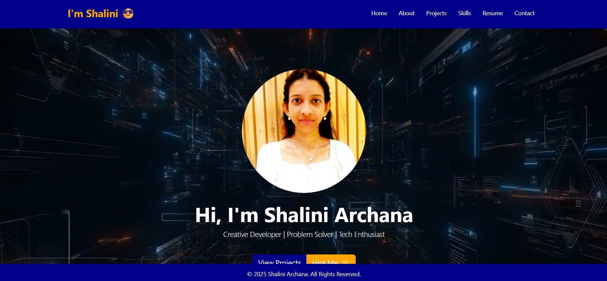
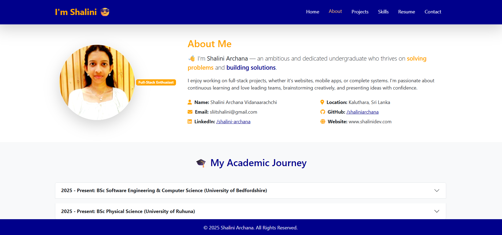
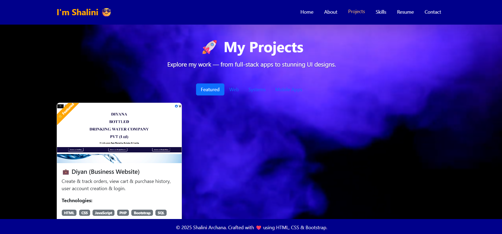
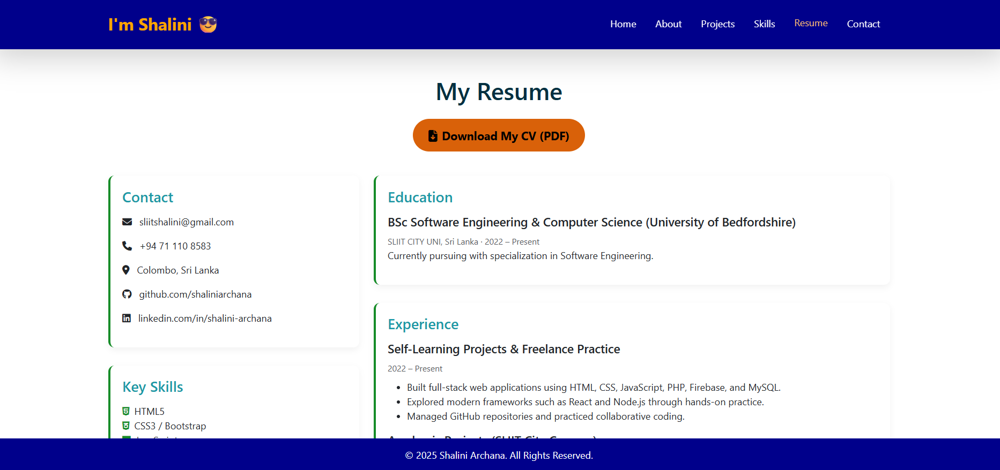
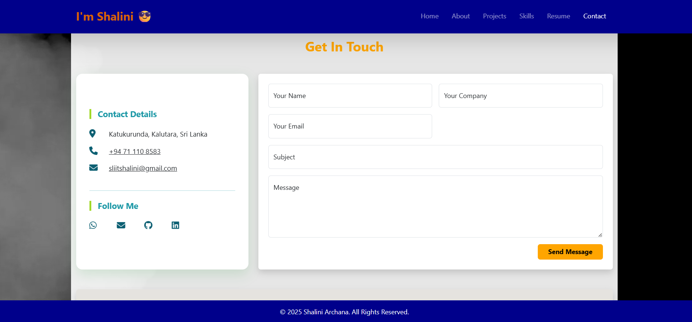

# 🌟 Personal Portfolio – Shalini Archana Vidanaarachchi

  
  
  
  
  
  

  <strong>Developed by:</strong> Shalini Archana Vidanaarachchi  
   
  A responsive, elegant portfolio showcasing academic, individual, and group-based projects.

## 🎯 Overview

This is my **personal portfolio website**, built from scratch to showcase:
- 🎓 Academic projects
- 👩‍💻 Individual and group assessments
- 🧠 Self-learned and passion projects

The site reflects my skills, achievements, and journey as a student and developer in **Software Engineering and Computer Science**.

## 🖼️ Features

- 💡 Clean and modern design with **Bootstrap** styling
- 🧑‍💼 Portfolio section listing all types of projects
- ✉️ Contact form powered by **Formspree**
- 🔁 AJAX-based smooth form submissions
- 📱 Fully responsive for mobile, tablet, and desktop
- 🌐 Easy navigation with scroll-based UI

💌 Contact Form
The contact form uses Formspree to handle form submissions securely without a backend server.

📸 Screenshots (optional)

  
  
  
   
  
  
  

  <em>⭐ A constellation of my favorite works – from academic projects to creative self-learnings.</em>

📬 Connect with Me
Made with ❤️ by Shalini Archana Vidanaarachchi

    

🎉 Final Words
Thank you for visiting my portfolio!
It reflects my journey, dedication, and continuous growth in the field of Software Engineering.

“A portfolio is a living, breathing showcase of who you are as a developer.”
